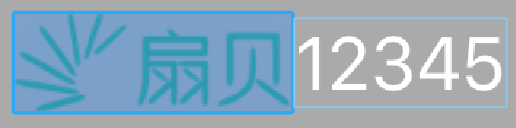
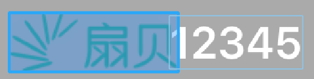

---
相信大家都清楚，iOS 设备上我们可以设置系统字体显示效果，比如字体变大或者加粗之类的。但如果使用的是自定义字体的话，则不在以上开关打开之后的调整范围之内。如果你的 App 想要适配这种情况的话，可能有一些周折，因为这里的 Bold Text 有一个坑点。这也致使我们的“上帝”向我们提出了批评：`你们的前端该换人了`，虽然这实际上是移动端的事，或者说是 iOS 的问题，😂
<!-- more -->

## iOS：我怎么坑你了？
首先我们得创建一个 `UIButton`，这个按钮需要设置一张图片，即调用 `setImage(#imageLiteral(resourceName: "imageName"), for: .normal)`。然后在 Simulator 上跑起来，在 Bold Text 生效之前，在 [Reveal](https://revealapp.com) 中，按钮显示效果是这样的：(iOS 12.2)

图片与文本的界限是很清楚，在默认的 `imageEdgeInsets` 和 `titleEdgeInsets` 情况下，图片与文本之间是没有重叠部分的。但是这种“距离美”在 Bold Text 生效之后就变成这样了：

当你测量过前后按钮的宽度后你会发现，Bold Text 生效后按钮会更宽，这是合乎清理的。因为字体都加粗了，肯定需要更大的空间去渲染它，但它却是向两边延伸的。注意，这和 `titleLabel` 的 `textAlignment` 是没有关系的，因为我们这里用的是它的固有尺寸。

## 适配 Bold Text
一个简单的思路就是调整 `imageEdgeInsets` 和 `titleEdgeInsets`，如果标题与图片之间不需要 spacing 的话，那么就设置为 0。但是事情不是这么简单，因为 Bold Text 生效之后，出现标题和图片之间重叠的时候，系统依然会认为它们的 spacing 就是 0，因为你事先并没有通过代码去调整 `imageEdgeInsets` 和 `titleEdgeInsets`。所以你还需要累加上一个值：图片与标题重叠区域的某个分量，具体是宽还是高，取决于图片与标题的相对位置，这可以借助博主之前写过的一个简单[UIExtensions](https://github.com/ZeroOnet/UIExtensions)来完成，😄

祝玩得开心！
