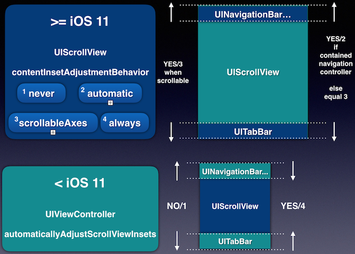
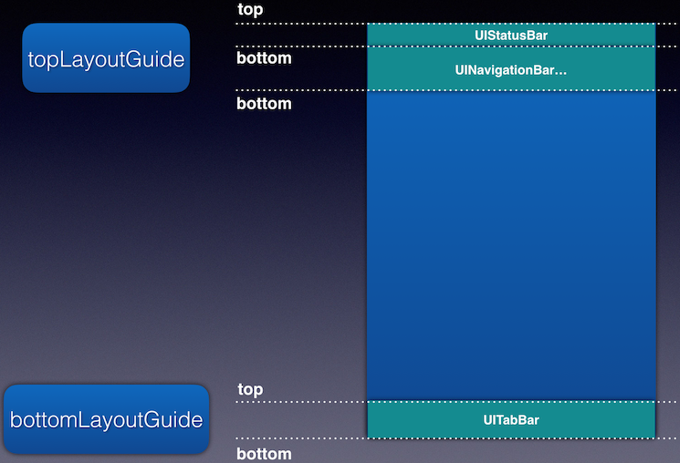

---
早在 iPhone X 发布的时候，即 iOS 11 的时候，就加入了一个新的关于布局的概念：Safe Area，它可以帮助我们让 UI 不被 `UINavigationBar`、`UITabBar` 和 `UIStatusBar` 遮挡。而苹果为了让开发者更好适配刘海屏搞出来的这一套东西，对于老项目的 UI 适配可能不是一个好消息，如果你是基于 `UINavigationBar` 或 `UITabBar` 来布局的，系统可以很好地帮助你完成。但是对于一些静态界面，可能你得慢慢理理，然后让涉及到的代码适配 Safe Area。也因此你会看到几乎所有 App 在 iPhone X 出来之后，都会有一次更新，其中的更新信息中就有适配 iPhone X。但是在 iPhone XS/XR 上使用的 App，你可能还是会发现有些 UI 布局还是有点问题，而在 iPhone X 上却又是正常的(就像扇贝的 App，自黑一波～)，原因在于当初适配 iPhone X 时只是简单的用了一个判断 isIPhoneX 来决定 UI 的样子。
<!-- more -->

## isIPhoneXSeries?
一句话概括当时使用 isIPhoneX 的原因：省时，省力，更省心。

相信 iOS 的各位同行对于 iOS 原生的 AutoLayout 的写法之神奇早就深有体会，而目前普遍使用的封装 AutoLayout 的知名好用的开源库大多为 SnapKit(only Swift) 和 Masonry(Objective-C 编写，但 Swift 也可用，只要你看那一堆 ? 不觉得糟心，👀)。而在 iPhone X 发布后，我们需要快速地完成适配，并且同时手里还有各种事情要忙，上述的两个库又暂时没有 Safe Area 的支持，又要考虑到最小改动原则来降低 UI 错乱的风险，于是采用了这个下下之策，先自扇一耳光表示认错，🤦‍♂️

然后，新的刘海屏 iPhone 出来了，然后又得适配一波了！使用 isIPhoneXSeries? 问问观众答应不答应～

## Safe Area 改变了啥?
- `UIView` 加入了 `safeAreaInsets` 属性和 `safeAreaLayoutGuide` 属性，后者用于取代 `UIViewController` 的 `topLayoutGuide` 和 `bottomGuide`。`safeAreaInsetsDidChange` 方法可以监听 `safeAreaInsets` 的改变。
- `UIScrollView` 加入了 `contentInsetAdjustmentBehavior` 属性，取代 `UIViewController` 的 `automaticallyAdjustsScrollViewInsets`。
- `UIViewController` 加入了 `addtionalSafeAreaInset` 属性，用于扩展 Safe Area。`viewSafeAreaInsetsDidChange` 方法可以监听根视图和子视图 `safeAreaInsets` 的改变。

`safeAreaInsets` 反映的是视图与 Safe Area 的距离，即视图超出 Safe Area 的区域上下左右的值。

`automaticallyAdjustsScrollViewInsets` 是用来调整 `UIScrollView` 的视图内容，避免其被 `UINavigationBar` 和 `UITabBar` 遮挡，通过 `adjustContentInset` 属性我们可以得知其内容视图相对于 `UIScrollView` 的 `frame` 的偏移量。它有如下几个值：

- never: `adjustedContentInset` = `scrollView.contentInset`。
- always: `adjustedContentInset` = `scrollView.contentInset` + `safeAreaInset`。
- scrollableAxes: 在可滚动方向上 `adjustedContentInset` = `safeAreaInset` + `contentInset`，在不可滚动方向上 `adjustedContentInset` = `contentInset`。
- automatic: 如果 `scrollview` 在一个 `automaticallyAdjustsScrollViewContentInset = YES` 的控制器上，并且它被包含在一个 `navigation controller` 中，这种情况下会在 `top & bottom` 上设置  `adjustedContentInset` = `safeAreaInset` + `contentInset` 不管是否滚动。其他情况下与UIScrollViewContentInsetAdjustmentScrollableAxes相同，用一张图概括：
  


## 如何使用 Safe Area?
如果你用的是 IB 搭建的界面，那么你很幸福，将 `Use Safe Area Layout Guides` 打开就可以解决绝大多数问题了。但是，如果你用的是 `xib`，那么不好意思，你可能还需要忙活一阵！我们都知道 `safeAreaLayoutGuide` 是 `top/bottomLayoutGuide` 的替代品，在 iOS 11 一下，IB 会自动将 `safeAreaLayoutGuide` 回退到 `top/bottomLayoutGuide`，但这只对于 `storyboard scene` 有效，我们可以手动测试，将 ``Use Safe Area Layout Guides` 选项关掉，`top/bottomLayoutGuide` 就会出现在控制器对应的 scene 下面， 而 `xib` 描述的是控制器的视图，`top/bottomLayoutGuide` 这个控制器本身的属性自然而然在 iOS 11 之下无法起作用，那么带来的问题是什么呢？我们不妨先来看看，它们是做什么的：



经过实际项目中辛酸泪发现，如果根视图的子视图顶部约束依赖的是 `safeArea.top`，那么在 iOS 11 一下，`xib` 的这个子视图的顶部约束实际上是相对于屏幕顶部，而非 `UIStatusBar` 的底部，这就导致子视图与 `UIStatusBar` 重叠。 而 `storyboard scene` 中由于 `top/bottom LayoutGuide` 的存在，不会存在此问题，🤷‍♂️ 解决方法就是将这个顶部约束添加 `Outlet`，然后在 iOS 11 一下的设备上手动加上 `UIStatusBar` 的高度 20。也亏的这高度是固定的，不然要整死人，可见这又是一个使用 `storyboard` 而非 `xib` 的理由。

有了以上分析，对于用代码搭建的界面，需要考虑 Safe Area 的布局使用像如下形式的编码就可以了：

```Swift
// SnapKit
if #available(iOS 11.0, *) {
    make.top.bottom.equalTo(view.safeAreaLayoutGuide)
} else {
    make.top.equalTo(topLayoutGuide.snp.bottom)
    make.bottom.equalTo(bottomLayoutGuide.snp.top)
}
```

```Objective-C
// Masonry
if (#available(iOS 11.0, *)) {
    make.top.equalTo(self.view.mas_topMargin);
    make.bottom.equalTo(self.view.mas_bottomMargin);
} else {
    make.top.equalTo(self.mas_topLayoutGuideBottom);
    make.bottom.equalTo(self.mas_bottomLayoutGuideTop);
}
```

可见这种代码写起来并不简洁，起初想过对其进行封装，但考虑到 `safeAreaLayoutGuide` 和 `top/bottom LayoutGuide` 这两种属性的拥有者不属于统一类型，实在没有想到可行的且简洁的方式，就只能暂时这么做了。如果各位有什么好的意见，欢迎评论留言，🙏

## 参考资料

[腾讯 Bugly iOS 11 安全区域适配总结](https://mp.weixin.qq.com/s/W1_0VrchCO50owhJNmJnuQ)


